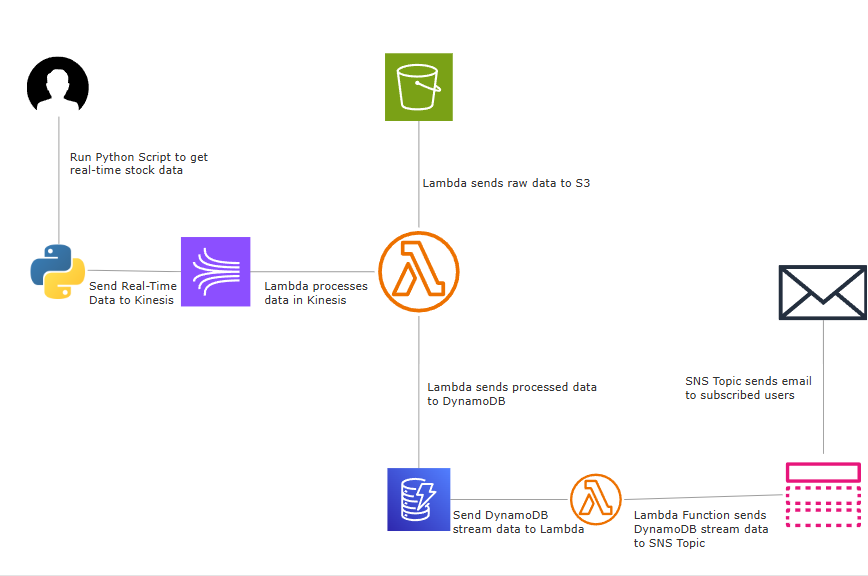

# Real-Time Stock Market Data Analytics Pipeline (AWS)
**Author:** Ishan Lakhotia

## Overview

This project implements a **real-time, event-driven stock market data analytics pipeline** using AWS managed services.  
The system ingests live stock price data, processes it in real time, stores both raw and processed data, and triggers downstream alerts using a scalable, decoupled architecture.

The goal of this project is to demonstrate:
- Real-time data ingestion
- Stream processing
- Serverless compute
- Event-driven architecture
- AWS-native integrations

---

## Architecture Diagram

## Architecture Breakdown

### 1. Data Ingestion (Local to Kinesis Data Streams)
- A local Python script fetches real-time stock market data from an external API.
- Each stock update is serialized as JSON and sent to Amazon Kinesis Data Streams.

### 2. Stream Processing (Kinesis → Lambda)
- A **Lambda function** is triggered by incoming Kinesis records.
- The function:
  - Decodes and parses the incoming JSON payload
  - Writes raw, unmodified data to an Amazon S3 bucket for long-term storage and replay
  - Extracts and stores processed fields into Amazon DynamoDB

### 3. Data Storage
- **Amazon S3**
  - Stores raw stock tick data as JSON files
  - Acts as a data lake for historical analysis or batch processing

- **Amazon DynamoDB**
  - Stores processed, query-optimized stock data
  - Uses a UUID as a partition key and sort key to efficiently query time-series data

### 4. Event-Driven Alerts (DynamoDB Streams → Lambda → SNS)
- DynamoDB Streams are enabled with `NEW_IMAGE` to capture real-time inserts.
- A second Lambda function is triggered when new records are written to DynamoDB.
- This function puts records to an Amazon SNS topic

### 5. Notifications
- The Amazon SNS topic distributes alert events to subscribed endpoints.
- Email notifications are sent using SNS subscriptions to subscribed emails 
- This allows real-time user alerts without tightly coupling notification logic to the core pipeline.

## Key AWS Services Used

- Amazon Kinesis Data Streams – Real-time data ingestion
- AWS Lambda – Serverless stream and event processing
- Amazon S3 – Raw data storage
- Amazon DynamoDB – Processed data storage
- DynamoDB Streams – Change data capture
- Amazon SNS – Event notifications and alerting
- IAM – Secure, least-privilege access control

## Conclusion

This project demonstrates how to design and implement a scalable, real-time analytics pipeline on AWS using managed and serverless services and best practices.  

